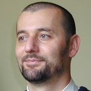

# Muharem Hrnjadovic: curriculum vitae

# About me
Functional programming geek with 20+ years of software development experience
and solid instincts in the areas of system architecture and distributed
systems. Passionate about delivering clean, elegant and correct code.

# My skills

## Programming languages
 * Python: 6+ years of experience, see e.g. the [OpenQuake engine](https://github.com/gem/oq-engine) for some samples of my work
 * [erlang](https://www.fastcompany.com/3026758/inside-erlang-the-rare-programming-language-behind-whatsapps-success): solid knowledge and [some code experiments](https://github.com/freizeit/exercises/tree/master/cj-a-store-credit/erlang)
 * [elixir](https://pragprog.com/book/elixir/programming-elixir): solid knowledge, also wrote a couple of small tools using it.
   Here's an [example](https://github.com/arbeit/mmt)
 * ocaml: solid knowledge and [some code experiments](https://github.com/freizeit/exercises/tree/master/cj-a-store-credit/ocaml)

## Remote work
I have worked remotely and/or with remote teams for 5+ years. This is my preferred modus operandi.

## Operating systems
Various linuxes e.g. Ubuntu, Arch

## Miscellaneous skills
 * Cloud computing: AWS and OpenStack. Here's an [AWS proof of concept](https://github.com/freizeit/auto-scaling-demo) I was asked to develop some time ago
 * Postgres: have extensive hands-on experience with it. I was the "database guy" in more than one project :)
 * RabbitMQ: used it quite a bit in the OpenQuake project, did most of the trouble-shooting and debugging on the distributed computation cluster.
 * Automation & deployment: I know of tools like puppet, ansible etc. and have dabbled with them. Have also played with docker more recently.

## Social
### Agile teams
I have built and led a number of agile and distributed software development teams in the last couple of years

### Community
 * I started and ran the [biggest IT meetup group in Zurich](http://www.meetup.com/zhgeeks/) for a number of years
 * I was one of the founders the [Swiss OpenStack user group](http://www.meetup.com/openstack-ch/)

# Opinions and prejudices

 * the perfect is the enemy of the good
 * untested code is broken code
 * automate or die!
